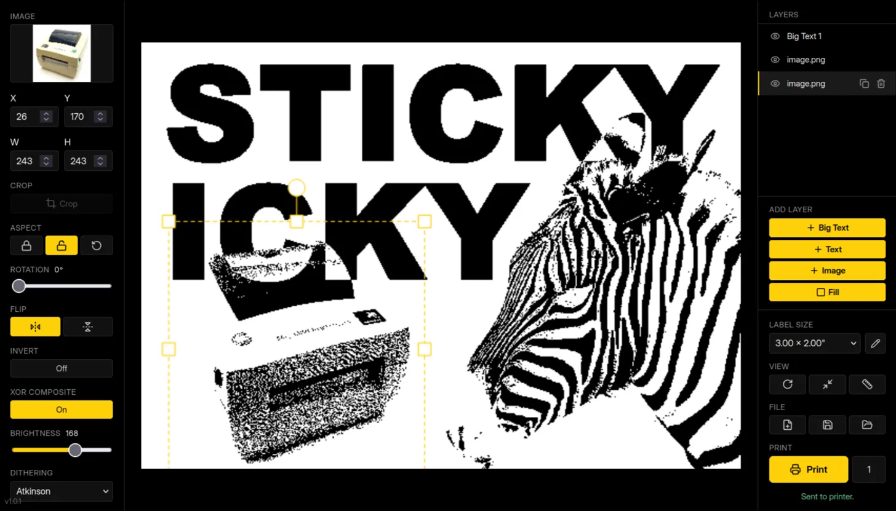

# Sticky Icky



Turn electronic eBay waste into art.

Sticky Icky is a browser-based sticker design tool for the Zebra LP2844 thermal printer — the kind you can grab on eBay for $40.

Design labels in your browser, hit print, and a sticker comes out. Text, images, layers, dithering — everything renders at the printer's native 203 DPI so what you see is what you get.

Yes, the output is crunchy. Yes, the dithering is loud. Yes, photos look like they were faxed in 1994. That's the point — 1-bit, 203 DPI, direct thermal. Lean into it.

## Features

### Layers

- **Big Text** — type something, it auto-sizes to fill the entire label
- **Free Text** — positioned text with manual font size, rotation, flip
- **Address** — multi-line mailing block that auto-fits to the label, optional country-flag Postcrossing ID banner, OCR an address straight out of an image. See [Address layer](#address-layer) below.
- **Image** — import PNG/JPG/GIF/WebP via drag-and-drop, paste from clipboard, or file picker. Crop, rotate, scale, flip. Optional EPX 2× upscale for pixel art, plus Otsu auto / manual threshold mode that bypasses dithering for clean line art.
- **Shape** — rectangle, ellipse, polygon (3–12 sides), star (3–12 points), or line. The old standalone Solid Fill layer is now a black-filled rectangle.

### Dithering

Photos and grayscale images need to be converted to pure black and white for the thermal printer. The app includes five dithering algorithms — Floyd-Steinberg, Atkinson, Riemersma (Hilbert-curve), Bayer 4×4, and Bayer 8×8 — with an adjustable amount slider. Each layer has its own dithering settings. Optional sRGB gamma correction in Settings keeps midtones honest across the threshold cutoff.

### Compositing

Layers composite with XOR by default — where two black regions overlap, they flip to white. This lets you cut shapes out of other shapes. You can switch any layer to plain overwrite mode instead.

### Fill patterns

Text, Big Text, Address, and Shape layers can be filled with 1-bit patterns instead of solid black — solid, dotted greys, lines, grids, bricks, waves, diamonds. Twelve built-ins, plus a 32×32 editor for rolling your own. Favourites, deletion-with-usage-check, and a graceful fallback to solid for designs that reference a deleted custom pattern.

### Address layer

Made for mailing-label blocks — Postcrossing, the local craft fair, whatever. The address layer occupies the full label like Big Text (no x/y/size handles — it owns the label) and binary-searches the largest font size that fits all your lines into the available area. Up to seven lines, bold/regular toggle, the same 18-font dropdown as the other text layers. A 1-dot black hairline frames the address; the frame shrinks to wrap the fitted text with even padding on all four sides regardless of how many lines you typed.

**Postcrossing ID banner.** Drop a Postcrossing ID (e.g. `US-12345`) into the ID field and a solid-black banner appears in the top-left corner of the address frame, with the country flag and the ID printed in white. The country code is parsed from the `XX-…` prefix; the banner grows to the right as the ID gets longer. Currently only the US flag ships in the box — to add a country, drop a black-on-white SVG into `frontend/src/assets/flags/<XX>.svg` and register the ISO code in `frontend/src/utils/flags.js`. Unknown codes fall back to "no flag, ID only".

**OCR from image.** Postcrossing hands out new addresses as flat images. The "OCR from image…" button under the address textarea opens a modal that accepts a drag-drop, a clipboard paste, or a file pick — Tesseract.js then OCRs it in your browser and dumps the recognized lines into the textarea, ready for you to fix up. All assets are served same-origin from `/tesseract/` — no third-party calls. The bundle includes English + German + Chinese (simplified & traditional) + Japanese + Russian language packs (≈10 MB compressed) to cover the top Postcrossing origin countries; languages are loaded together and the engine code itself is dynamically imported so the cost is only paid when you click the button.

### Typography

18 fonts: Arial Black, Barriecito, Bebas Neue, Boldonse, Bungee, Comic Neue, Courier New, Creepster, Georgia, Great Vibes, Impact, Inter, Jacquarda Bastarda 9, Jersey 10, New Rocker, Press Start 2P, Silkscreen, VT323.

Text layers support All Caps, Small Caps, Italic, four horizontal alignments (left/center/right/justify), and letter-spacing adjustment. Big Text also has vertical alignment (top/center/bottom).

### Editor

- Drag to move, 8 resize handles, rotation arm (hold Shift for 45-degree snap)
- Hold Shift while resizing to toggle aspect-ratio lock
- Double-click a text layer to focus its text input
- Arrow keys nudge 1px (10px with Shift)
- Delete removes the selected layer
- Ctrl+Z / Ctrl+Shift+Z for undo/redo (20 steps)
- Ctrl+D to duplicate a layer
- Ctrl+V to paste an image from clipboard
- Escape to deselect

### Viewport

- Rotate view 90 degrees for designing tall/narrow labels in landscape orientation
- True-size mode shows the label at its real physical dimensions (requires a one-time screen calibration)

### Saving and exporting

- Save / Save As to your browser's IndexedDB with overwrite-collision protection
- Gallery with favorites, pagination, and storage usage readout
- Export as PNG or JSON, import from JSON

### Printing

- One-click print with configurable copy count
- Custom label-size presets (add, delete, favorite — stored in IndexedDB)
- Settings modal (gear icon) for darkness, speed, X/Y offset, gamma correction, screen-DPI calibration, plus three themes (Light / Dark / OLED) and nine accent colours

## Getting the hardware

### The printer

LP2844s are everywhere on eBay for $30-60. Search for "Zebra LP2844" and look for listings that include a power supply. UPS-branded, FedEx-branded, and retail Zebra units all work with this project.

This app speaks EPL2 only. Newer Zebra printers (ZD-series, etc.) that speak ZPL won't work without rewriting the backend.

### Labels

Buy direct-thermal labels — the kind that turn black when you scratch them with a fingernail. Don't buy thermal-transfer labels (the kind that need a ribbon) — they'll produce blank output. The print head is 832 dots (4.09") wide at 203 DPI. The default label size in the app is 3.00" x 2.00", but any size works.

### Serial cable

You need a USB-to-serial adapter connected to the LP2844's DB-9 serial port. Budget $10-15 for an FTDI-based adapter. **Don't use the printer's built-in USB port** — see [Firmware and transport notes](#firmware-and-transport-notes) below for why.

## Deployment

Images are built automatically by GitHub Actions on every push to `main` and pushed to GHCR. You need any Docker host with a USB port for the serial adapter.

```bash
# Copy docker-compose.prod.yml and .env.example to your server
cp .env.example .env
# Edit .env — set CORS_ORIGINS to your domain (e.g. https://stickers.example.com)

docker-compose -f docker-compose.prod.yml pull
docker-compose -f docker-compose.prod.yml up -d
```

The printer's USB-to-serial adapter must be plugged in before starting — Docker maps `/dev/ttyUSB0` into the backend container.

Images: `ghcr.io/nastronot/sticky-icky-frontend:latest` and `ghcr.io/nastronot/sticky-icky-backend:latest`.

The frontend (nginx) serves the app on port 3000 and proxies `/api/` requests to the backend. The backend talks to the printer over serial.

### Environment variables

- `CORS_ORIGINS` — comma-separated allowed origins (set in `.env` next to the compose file)
- `SERIAL_PORT` — override the default `/dev/ttyUSB0` if your printer is at a different path

### Local dev

```bash
# Frontend
cd frontend && npm install && npm run dev

# Backend (separate terminal)
cd backend && python -m venv venv && . venv/bin/activate
pip install -r requirements.txt
uvicorn main:app --reload --port 8765

# Open http://localhost:5173
```

## Architecture

```
Browser (React + Canvas)
  → renders each layer at 203 DPI
  → XOR composites visible layers
  → packs 1-bit bitmap, base64 encodes
  → POST /print

FastAPI backend
  → validates request
  → inverts bit polarity (GW expects 0=black)
  → wraps in EPL2 commands
  → writes to /dev/ttyUSB0 at 38400 baud
```

The frontend does all the rendering. The backend is ~120 lines — it just validates, inverts the bits, wraps the bitmap in EPL2 framing, and writes it to the serial port.

## Tech stack

- **Frontend**: React 19, Vite 8, HTML5 Canvas (no frameworks), lucide-react icons
- **Backend**: FastAPI, pyserial, slowapi (rate limiting)
- **Storage**: IndexedDB — designs, presets, patterns, and settings (theme, accent, screen DPI, print params)
- **Protocol**: EPL2 over serial — 38400 baud, 8N1, RTS/CTS hardware flow control

## Security

There is no built-in authentication. The app assumes a trusted network layer in front — Cloudflare Access, a VPN, or LAN-only access. Do not expose the backend directly to the public internet.

The backend enforces CORS origin checking, rate limiting (10 requests/minute on `/print`), a 1 MB request size limit, and input validation on all fields.

## License

Licensed under the GNU General Public License v3.0.

---

# Firmware and transport notes

This section exists for the next person who buys an LP2844 off eBay and spends a week wondering why their printer ignores them. None of it is required to use Sticky Icky — it works out of the box with the serial cable. Read on if things aren't working, or if you're curious why this project took the shape it did.

## The short version

This project was developed and verified against an LP2844 running firmware **`UKQ1935HLU V4.29`**, printing via a USB-to-serial adapter to the printer's DB-9 port at 38400 baud, 8N1, with RTS/CTS hardware flow control. If your printer matches that configuration, everything should just work.

If you try updating your firmware to "fix" anything, it may stop working. Don't update unless you have a specific reason to.

## Why serial and not USB

The EPL2 `GW` (Direct Graphic Write) command — the one this project uses to send bitmaps to the printer — is quietly broken over USB on certain firmware versions, including the V4.29 this project runs on. The printer accepts the `GW` payload, reports no error, and produces a blank label. Every time.

What was tried before landing on serial:

- **CUPS raw queue** — works, but adds pointless indirection for raw EPL2 output
- **Direct USB with `GW`** — silently produces blank labels on V4.29
- **Direct USB with `LO` (Line Draw)** — works for sparse content, overwhelms the printer's command buffer on dense raster data
- **Serial with `GW`** — works reliably on the first try

Same `GW` command, different transport. Whatever is broken in the USB path is fine on serial. The serial path has also proven portable across every LP2844 variant it's been tested on, regardless of firmware branding, so that's where this project lives.

## LP2844 firmware variants

LP2844s come in two broad flavors: stock retail Zebra and carrier/VAR rebrands (UPS, FedEx, and others). The rebrands ship with modified firmware, and the rebranded firmware **silently refuses stock Zebra firmware updates** — the Z-Downloader tool reports success, the printer acknowledges the bytes, and then the bytes are discarded without being written to flash. The printer keeps running the old firmware with no error shown.

### Checking what you have

On many rebranded units the feed-button shortcut for printing a configuration label is disabled. The reliable way is to send an EPL2 `U` command directly:

```bash
echo -e "U\r\n" > /dev/ttyUSB0
```

The printer prints a configuration label with the firmware version on the first line. Common prefixes:

- `UKQ1935 Vx.xx` — stock retail Zebra firmware
- `UKQ1935 UPS Vx.xx` — UPS-branded
- `UKQ1935 FDX Vx.xx` — FedEx-branded
- `UKQ1935HLU Vx.xx` and other three-letter codes — other carrier/VAR rebrands

If your first line shows anything other than `UKQ1935 Vx.xx`, you have a branded variant and stock updates will fail silently.

### Updating (if you must)

Retail units (`UKQ1935 Vx.xx`) can usually be updated to V4.70.1A via Zebra's Z-Downloader, which in principle restores full `GW`-over-USB support and makes this project's serial workaround unnecessary.

Rebranded units require [DCHHV/patch2844](https://github.com/DCHHV/patch2844), a tool produced from [2019 DEF CON Hardware Hacking Village research](https://dchhv.org/project/2019/01/27/ups2844convert.html) that reverse-engineered the firmware format and figured out how to construct update files the rebranded firmware will accept. The process requires dumping both flash ICs in-circuit with an SPI programmer to get the printer's starting blobs. It's a project.

**Why this wasn't done:** the serial path works, it works on every LP2844 regardless of branding, there's no risk of bricking the printer mid-flash, and the current architecture doesn't benefit meaningfully from switching transports. Updating is optional, low-value, and non-trivial in the rebranded case.

**Why updating might break Sticky Icky for you:** if you update your firmware and the new version handles EPL2 commands differently — different offsets, different buffer behavior, different `GW` semantics — the printed output may shift, truncate, or fail in new ways. The default `GW10,0` bitmap offset (configurable in Settings), the 245 KB image buffer limit, and the 38400 baud setting are all calibrated to the specific combination of firmware and hardware this project was built against. YMMV after an update.

## Troubleshooting

**Blank labels / nothing prints.** Make sure you're using the serial port, not USB. The LP2844's `GW` command doesn't work over USB on affected firmware. Confirm your firmware version as described above.

**"Permission denied" on `/dev/ttyUSB0`.** Run `sudo chmod 666 /dev/ttyUSB0` on the host, or add your user to the `dialout` group. This resets every time you unplug the adapter. A udev rule can make it persistent.

**Print cuts off partway through.** You're probably hitting the printer's 245 KB image buffer limit. Try a shorter label or less dense content.

**Label alignment is off.** Open the Settings modal (gear icon) → Print tab and tweak the X/Y offset (in dots). The defaults are X=10, Y=0, which line up with standard label stock — bump X up or down until your art lands where you want it.

**High-darkness, high-speed prints fail partway through.** The LP2844 print head can't sustain D13+ darkness at S2+ speed on dense raster content — it overdraws and stalls. The defaults are D15 S1, the empirically reliable combination for the dense art this app produces. You can tweak both in the Settings modal at your own risk.

**Firmware update won't take.** If you have a carrier-branded unit, stock Zebra firmware updates will be silently discarded. See [LP2844 firmware variants](#lp2844-firmware-variants).

**Feed button doesn't print a configuration label.** This is normal on many rebranded units. Use the EPL2 `U` command shown above instead.

## Shoutouts

https://github.com/AlpenglowIndustries/Stickers

https://github.com/mtbutler07/xkcd-serial-printer

https://github.com/DCHHV/patch2844

https://github.com/BigJk/snd

https://github.com/MultiMote/niimblue

https://github.com/eljojo/estrella

https://github.com/LingDong-/r1b

https://github.com/nmaggioni/MorningNews

https://github.com/chr15m/print-weather

https://github.com/mazoqui/thermy

https://github.com/HexaCubist/werewolf-receipt

https://beyondloom.com/blog/dither.html

https://surma.dev/things/ditherpunk/
